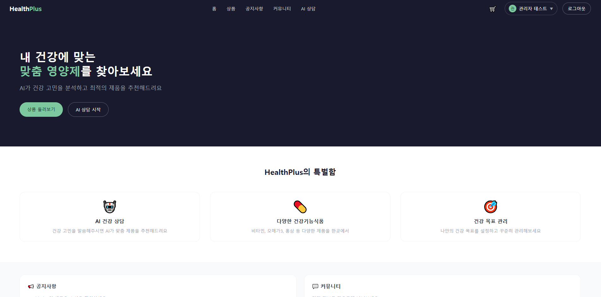

<div align="center">

# HealthPlus
### AI 건강기능식품 커머스 플랫폼


[](https://github.com/sotohone-png/healthplus/actions/workflows/ci.yml)


**AI가 사용자의 건강 고민을 분석해 맞춤 건강기능식품을 추천하는 플랫폼입니다.**
기획·개발·**QA**를 1인이 전 과정 진행한 개인 프로젝트입니다.

📄 [전체 QA 문서 (테스트 계획서 / 버그 리포트 / 트러블슈팅)](https://app.notion.com/p/Portfolio-39c3e8c6f43380319c8fe31509b5c5e7) &nbsp;·&nbsp; 🔗 [GitHub Actions](https://github.com/sotohone-png/healthplus/actions)

</div>

---

## 📑 목차

- [프로젝트 개요](#-프로젝트-개요)
- [기술 스택](#-기술-스택)
- [QA 활동 요약](#-qa-활동-요약)
- [개발 방식에 대해](#-개발-방식에-대해)
- [이 프로젝트를 통해 배운 것](#-이-프로젝트를-통해-배운-것)
- [주요 기능](#-주요-기능)
- [화면 미리보기](#️-화면-미리보기)
- [실행 방법](#️-실행-방법)
- [QA 자동화 테스트 실행](#-qa-자동화-테스트-실행)
- [프로젝트 구조](#-프로젝트-구조)

---

## 📌 프로젝트 개요

| 항목 | 내용 |
|---|---|
| 개발 기간 | 2026.06.26 ~ 2026.08.15 |
| 개발 인원 | 1인 |
| 개발 목적 | AI 기반 맞춤 건강기능식품 추천 및 구매 서비스 구현 |

## 🛠 기술 스택

**Front-End**
`React` `React Router` `Redux Toolkit` `Axios` `Tailwind CSS`

**Back-End**
`Spring Boot 3` `Spring Security` `JWT` `JPA`

**Database**
`MariaDB`

**AI**
`Anthropic API`

**QA / Test**
`Postman` `Playwright` `수동 테스트 (기능/부정/보안 테스트)`

---

## ✅ QA 활동 요약

이 프로젝트에서 가장 중점을 둔 부분은 **"기능이 동작하는가"를 넘어서 "왜 실패하는가, 어떻게 재발을 막는가"** 였습니다.

| 지표 | 결과 |
|---|---|
| 테스트 케이스 | 71건 작성 (기능/부정/보안 테스트) |
| 발견 및 해결한 버그 | 21건 (Critical 3건 · Major 13건 · Minor 5건) |
| API 자동화 테스트 | Postman으로 40여 개 엔드포인트 검증 |
| E2E 자동화 테스트 | Playwright로 9개 핵심 시나리오 자동화 |
| 회귀 테스트 | 버그 수정 6건에 대해 Postman/Playwright로 재검증 |

### 🔍 발견한 주요 이슈 (일부)

단순 UI 버그를 넘어, **인증/인가(Authorization) 관련 취약점**을 다수 발견하고 해결했습니다.

| 이슈 | 심각도 | 요약 |
|---|---|---|
| JWT 인증 우회 | Critical | 필터가 HTTP 메소드를 구분하지 않아, 조회(GET)만 허용해야 할 예외 규칙이 수정/삭제(PUT/DELETE) 요청까지 인증을 건너뛰게 만들던 문제 |
| 권한 우회(IDOR) | Critical | 리소스 삭제 시 클라이언트가 보낸 파라미터만으로 소유권을 판단하여, 로그인한 사용자가 파라미터 조작만으로 타인의 리소스를 삭제할 수 있던 문제 |
| 예외 처리 오분류 | Major | 인증 필터의 예외 처리 범위가 넓어, 인증과 무관한 서버 내부 오류까지 "인증 실패"로 잘못 보고되던 문제 |
| 데이터 정합성 | Major | AI 생성 텍스트 저장 시 컬럼 길이 초과로 인한 등록 실패 |

> 각 이슈의 재현 절차, 근본 원인 분석, 해결 방법, 회귀 테스트 결과는 Notion 문서에 상세히 기록되어 있습니다.

### 🧪 테스트 유형

- **기능 테스트**: 정상 시나리오 검증
- **부정 테스트**: 잘못된 입력, 빈 값, 경계값 처리 검증
- **보안 테스트**: 비회원/타 계정 접근 제어, 권한 우회 시도
- **회귀 테스트**: 수정된 버그의 재발 여부 재검증
- **API 테스트 (Postman)**: 요청/응답 자동 검증 스크립트 포함
- **E2E 테스트 (Playwright)**: 실제 브라우저에서 사용자 흐름 전체 자동화

---

## 🤖 개발 방식에 대해

이 프로젝트는 웹사이트 자체를 AI(Claude)의 도움을 받아 구축하고, QA 담당자로서 직접 버그를 발견·재현·원인 분석·회귀 테스트하는 방식으로 진행했습니다. "테스트 대상 시스템이 어떻게 동작하는지"를 코드 레벨까지 이해한 상태에서 테스트를 설계하고자 했고, 발견한 버그의 근본 원인을 코드 구조(Spring Security 필터 체인, JWT 인증 흐름 등) 안에서 직접 짚어내는 데 집중했습니다.

## 💡 이 프로젝트를 통해 배운 것

- **인증 필터의 예외 처리 범위가 넓으면, 전혀 다른 원인의 버그가 "인증 문제"로 위장되어 디버깅을 어렵게 만든다는 것.** 실제로 데이터베이스 제약 조건 위반으로 발생한 서버 오류가, 필터의 광범위한 예외 처리 때문에 "토큰 만료"로 잘못 보고되는 것을 발견하고 수정했습니다.
- **클라이언트가 보낸 값을 서버가 그대로 신뢰하면 안 된다는 것.** 리소스 삭제 권한을 URL 파라미터로 판단하던 로직을, 서버가 인증 토큰에서 직접 추출한 사용자 정보로 판단하도록 수정하며 인가(Authorization) 검증의 원칙을 체감했습니다.
- **API 레벨 테스트와 실제 사용자 흐름 테스트는 서로 다른 종류의 버그를 잡아낸다는 것.** Postman으로 확인한 수정 사항을 Playwright로 다시 검증하는 과정에서, 화면에서만 드러나는 타이밍 이슈(비동기 데이터 로딩 등)를 추가로 발견했습니다.
- **보안과 테스트 편의성은 트레이드오프 관계라는 것.** 반복 테스트 편의를 위해 토큰 유효시간을 임시로 늘렸다가, 테스트가 끝난 뒤 원래 값으로 되돌리며 "편의를 위한 임시 조치가 실제 설정에 남아서는 안 된다"는 걸 체감했습니다.

---

## 🖼️ 화면 미리보기

<!-- 아래 표에 실제 스크린샷을 추가하세요. 예:  -->

| 메인 페이지 | AI 건강 상담 | 상품 상세 (AI 설명) |
|---|---|---|
|
|
|
|

| 장바구니 | 관리자 - 공지사항 | 마이페이지 |
|---|---|---|
| _스크린샷 추가 예정_ | _스크린샷 추가 예정_ | _스크린샷 추가 예정_ |

---

## 🚀 주요 기능

- 회원가입 / 로그인 (JWT 기반 인증, 토큰 갱신)
- AI 건강 상담 및 상품 설명 자동 생성
- 상품 목록/검색/카테고리 필터/상세 조회
- 장바구니 / 주문 / 주문 취소
- 리뷰 작성 및 본인 확인 기반 삭제
- 건강 목표 관리 (등록/완료 처리/상태 표시)
- 커뮤니티 게시판, 공지사항 (관리자 권한 관리)
- 마이페이지 (주문 내역, 건강 목표 조회)

---

## ⚙️ 실행 방법

### Backend
```bash
cd back
./gradlew clean bootRun
```
- Java 21, Spring Boot 3, MariaDB 필요
- 기본 포트: `8080`

### Frontend
```bash
cd front
npm install
npm run dev
```
- Node.js, Vite 필요
- 기본 포트: `3000`

### 환경변수 설정

AI 기능(상품 설명 자동 생성, AI 건강 상담)을 사용하려면 환경변수에 본인의 Anthropic API 키를 설정해야 합니다.

```
ANTHROPIC_API_KEY=본인의_API_키
```

> 키가 없어도 회원가입/로그인/상품/장바구니/주문 등 핵심 기능은 정상 동작하며, AI 관련 기능만 제한됩니다.

---

## 🧰 QA 자동화 테스트 실행

### GitHub Actions (CI)
`main` 브랜치에 push하거나 PR을 올리면, GitHub Actions가 자동으로 백엔드·프론트엔드·DB를 띄운 뒤 Postman(API)과 Playwright(E2E) 테스트를 순서대로 실행합니다. 실행 결과는 저장소의 **Actions 탭**에서 확인할 수 있습니다. (워크플로우 정의: `.github/workflows/ci.yml`)

### Postman (수동 실행)
1. `ci/HealthPlus_API.postman_collection.json` Import
2. Collection Variables에서 테스트 계정 정보 설정
3. "01. 회원/인증" 폴더 실행 후 나머지 폴더 자유 실행

### Playwright (수동 실행)
```bash
cd e2e
npm install
npx playwright install chromium
npm run test:ui
```

---

## 📁 프로젝트 구조

```
healthplus/
├── .github/
│   └── workflows/
│       └── ci.yml        # GitHub Actions CI 파이프라인
├── back/                 # Spring Boot 백엔드
├── front/                # React 프론트엔드
├── ci/                   # CI용 Postman 컬렉션 · DB 시드 데이터
└── e2e/                  # Playwright E2E 테스트
```

---

<div align="center">

## 📬 Contact

관련 문의나 피드백은 언제든 환영합니다.

[](https://github.com/sotohone-png)

<sub>© 2026 HealthPlus. Licensed under the MIT License.</sub>

</div>
